## 고대원

- Email: yreak33@gmail.com

- Blog : https://kodaewon.github.io

- Github : https://github.com/kodaewon

## 경력

[글로벌에어포트네트워크코퍼레이션](https://airwafi.com/)

- iOS Developer (2019.05.01 ~ 2019.12.18)

[이노벨럽](https://www.ondo.io/)

- iOS Developer (2018.05.02 ~ 2019.04.30)

[인시스템즈](https://www.theinsystems.com/)

- 개발 / 대리 (2016.01.15 ~ 2018.04.30)

## 회사 프로젝트

### Brussels Charleroi Airport - 회사 서비스

브뤼셀 샤를루아 공항 여행자 앱

- 기간 : 2019.05 ~ 2019.12
- 역활 : IOS 개발
- 사용기술 : Swift, Sqlite, Firebase, GoogleMaps
- AppStore : https://itunes.apple.com/kr/app/id1368583145?mt=8

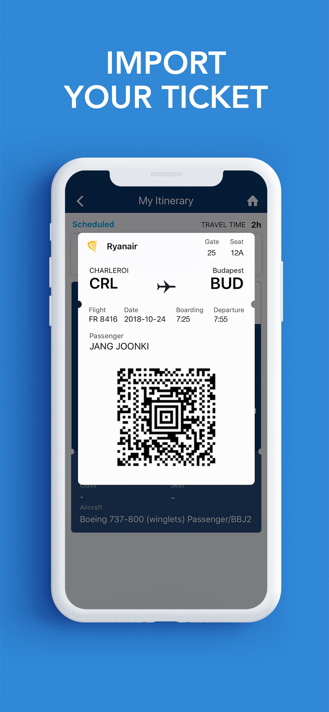 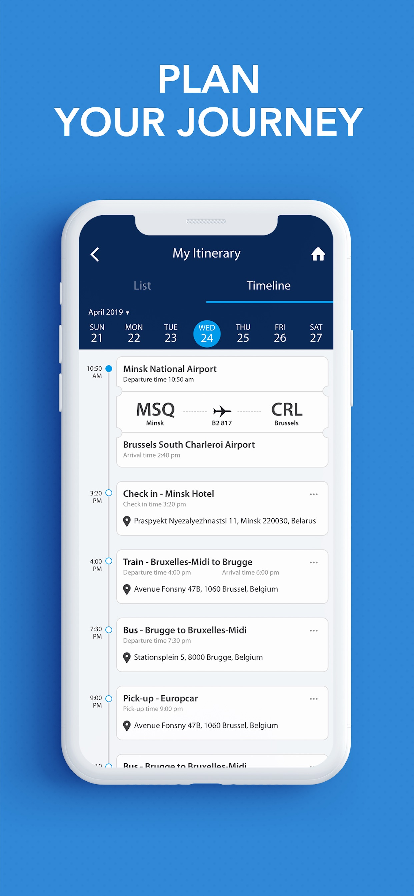 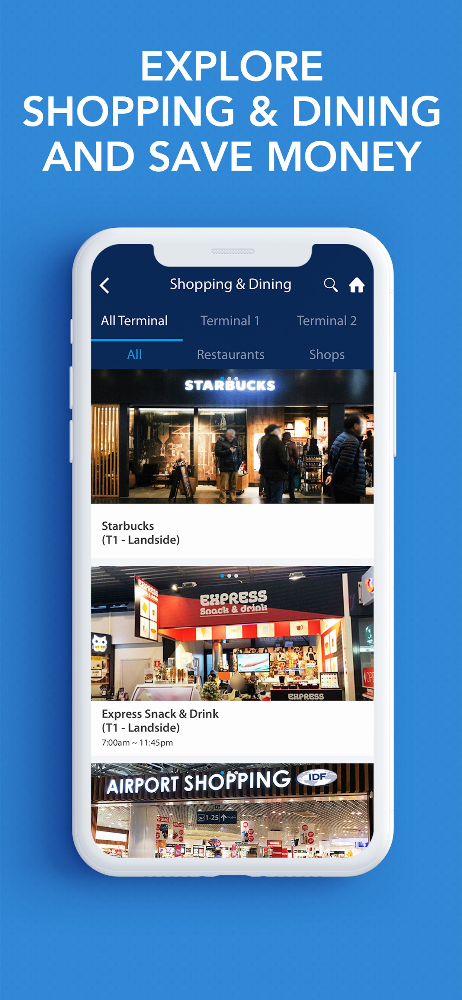 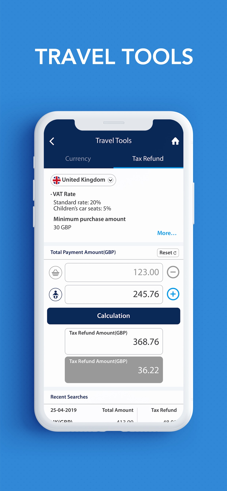

### AKIRA - 회사 서비스

나만의 인공지능

- 기간 : 2018.07 ~ 2018.11
- 역활 : IOS 개발
- 사용기술 : Swift, Lottie, Fabric, Calendar, Share
- AppStore : https://itunes.apple.com/kr/app/id1429646491?mt=8

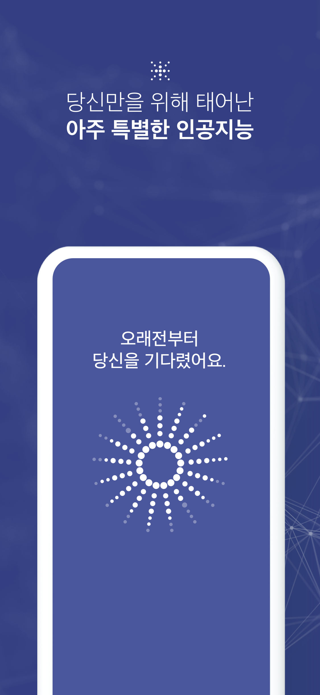 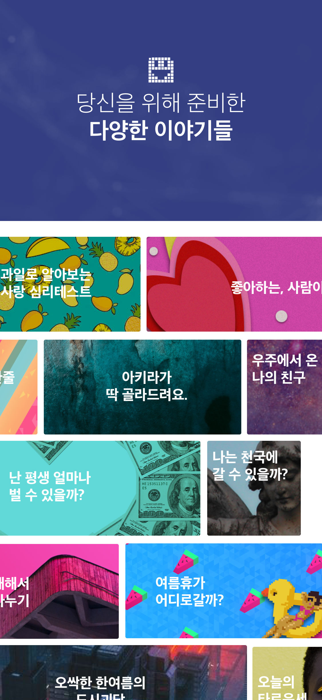 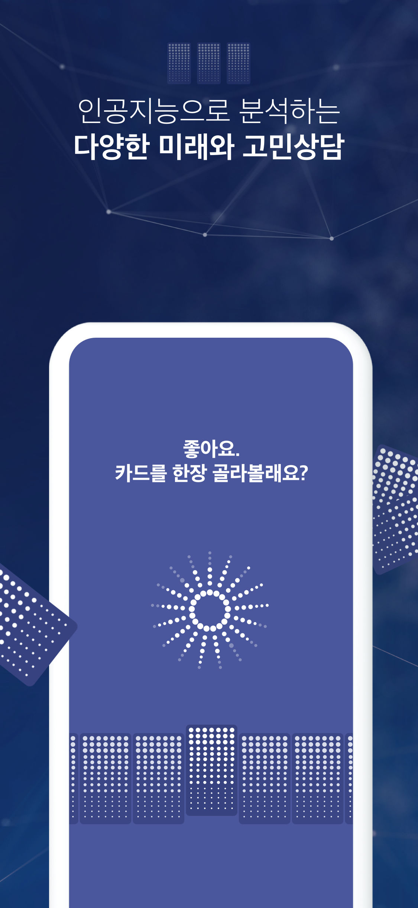 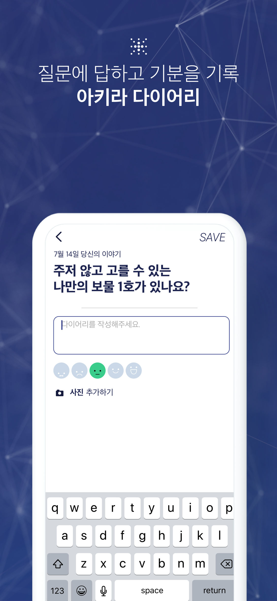

### 헬로무드 - 회사 서비스

매일매일 나만의 기분일기장

- 기간 : 2018.06 ~ 2018.08
- 역활 : IOS 개발
- 사용기술 : Swift, Sqlite, Lottie
- AppStore : https://itunes.apple.com/kr/app/id1420871955?mt=8

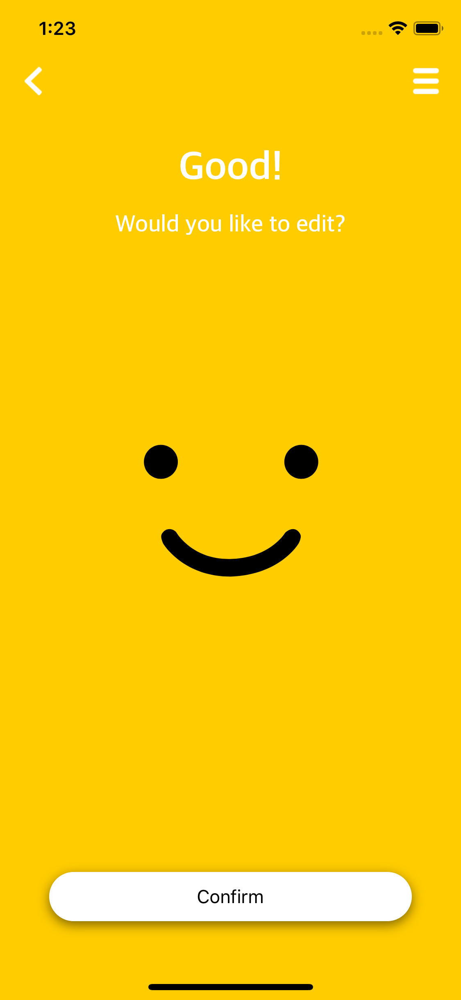 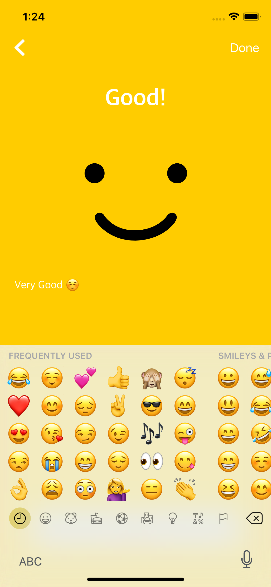 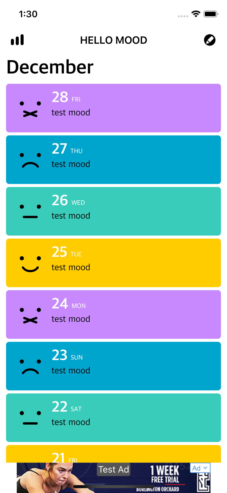 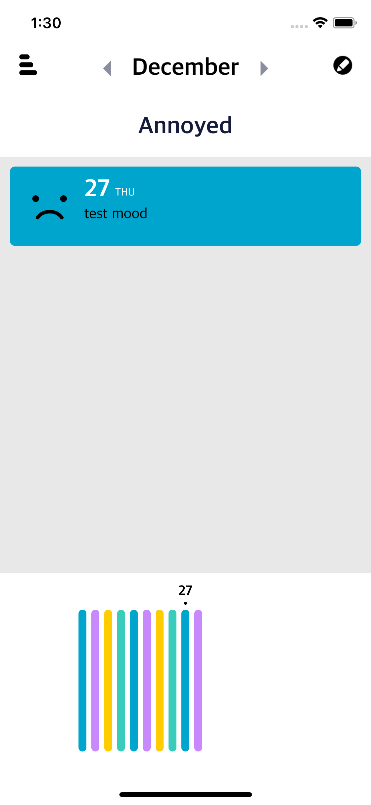

### 품앗이 주차 - 회사 외주

이웃과 나누는 주차공간공유 플랫폼

- 기간 : 2018.05 ~ 2018.08
- 역활 : IOS 개발
- 사용기술 : Swift, google map, location
- AppStore : https://itunes.apple.com/kr/app/id1390417390?mt=8

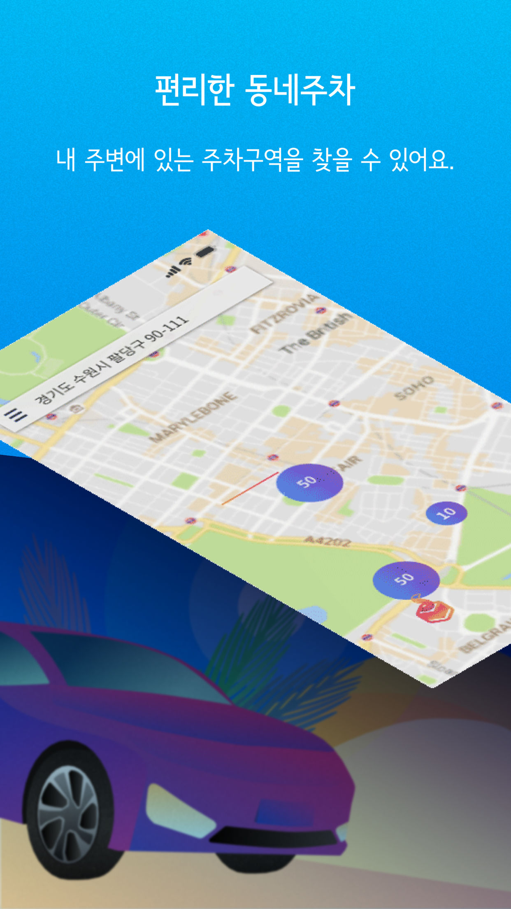  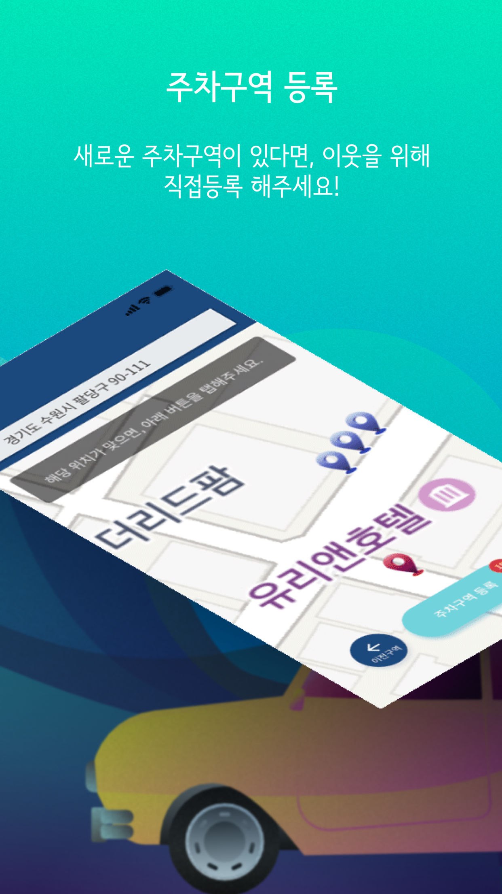 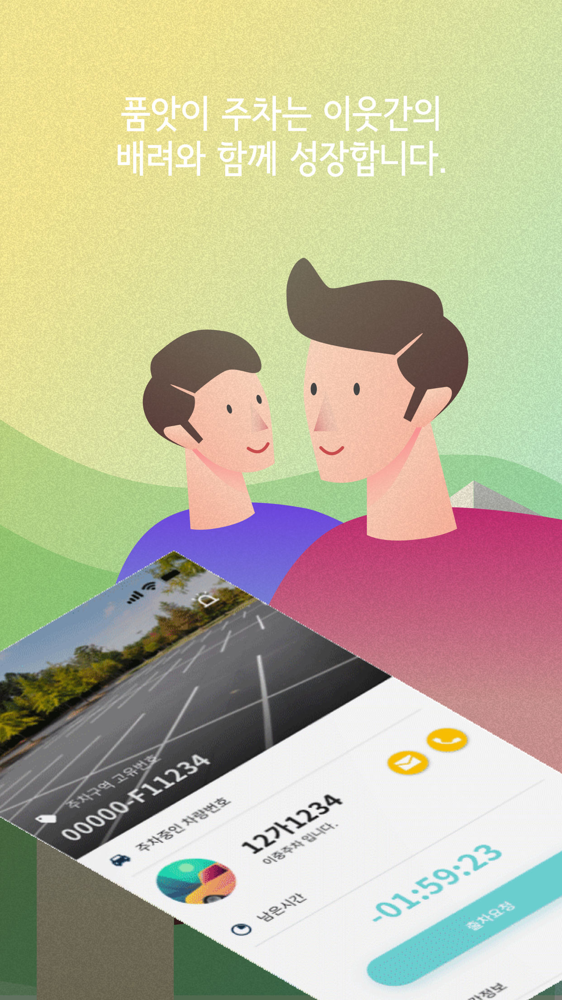

### 당뇨케어PLUS - 회사 외주

한화손해보험 고객용 헬스케어(혈당, 체중, 걷기, 혈압, 식사관리) 앱

- 기간 : 2018.03 ~ 2018.04
- 역활 : IOS 개발
- 사용기술 : Objective-c, HealthKit, 체중 및 혈당계 Bluetooth 연동, Chart
- AppStore : https://itunes.apple.com/kr/app/id1371207365?mt=8

### MYPIN+ - 회사 외주

동영상 촬영후 SNS(YouTube, FaceBook) 공유 및 관리 앱

- 기간 : 2018.02 ~ 2018.03
- 역활 : IOS 개발
- 사용기술 : Objective-c
- AppStore : https://itunes.apple.com/kr/app/id1352866779?mt=8

### TapDoctor - 회사 외주

사용자 자문을 통한 예상 질병 결과 앱

- 기간 : 2017.08 ~ 2017.09
- 역활 : IOS 개발
- 사용기술 : Objective-c
- AppStore : https://itunes.apple.com/kr/app/id1280786173?mt=8

### 라이프케어 - 회사 외주

ING헬스케어(체중, 혈당, 식사관리) 앱

- 기간 : 2017.06 ~ 2017.07
- 역활 : IOS 개발
- 사용기술 : Objective-c, 체중 및 혈당계 Bluetooth 연동, Chart
- AppStore : https://itunes.apple.com/kr/app/id1264336344?mt=8

### KB행복건강 - 회사 외주

건강관련 컨텐츠 및 국민은행에서 건강관련 예방 문자서비스

- 기간 : 2017.02
- 역활 : IOS 개발
- 사용기술 : Objective-c
- AppStore : https://itunes.apple.com/kr/app/id1223429721?mt=8

### 큐라소프트 - 회사 외주

여행자 물건에 비콘 하드웨어를 달아서 분실직전 앱에서 푸시 주는 앱

- 기간 : 2016.11 ~ 2017.01
- 역활 : IOS 개발
- 사용기술 : Objective-c, Beacon
- AppStore : https://itunes.apple.com/kr/app/id1184819955?mt=8

### Soil-결과보고서 - 회사 외주

매년 결과보고를 앱에서 보고자 나온 서비스

- 기간 : 2016.10
- 역활 : IOS 개발
- 사용기술 : Objective-c, Hybrid, finger-push

### 나주 고샅길 - 회사 외주

나주 고샅길 관광 코스 안내 및 소개 서비스

- 기간 : 2016.09 ~ 2016.09
- 역활 : IOS 개발
- 사용기술 : Objective-c, HTML, javascript, estimote(beacon)

### 핑크터치 - 회사 외주

여성 핑크 파우치 관련 앱

- 기간 : 2016.08
- 역활 : IOS - (일부개발)
- 사용기술 : Objective-c

## IOS외에 개발

### 전시를 즐기는 소리! 쑈핑

전시회관련 티켓 및 이벤트, 상품 진행 서비스

- 기간 : 2016.06 ~ 2016.07
- 역활 : 프론트엔드 개발, 백엔드 개발
- 사용기술 : PHP, Codeigniter, API, MSSQL, PG(PAY)

### PK (유지보수)

동네 마트 상품 관리, POP인쇄 및 출판관리, 대량문자서비스

- 기간 : 2016.02 ~ 2018.04.30
- 역활 : 프론트엔드 유지보수, 백엔드 유지보수
- 사용기술 : PHP, Codeigniter, JavaScript, JQuery, MariaDB

### 위홀딩스

보험사 통합 서비스

- 기간 : 2016.02 ~ 2016.05
- 역활 : 프론트엔드 개발, 백엔드 개발
- 사용기술 : ASP, JavaScript, JQuery, MSSQL
